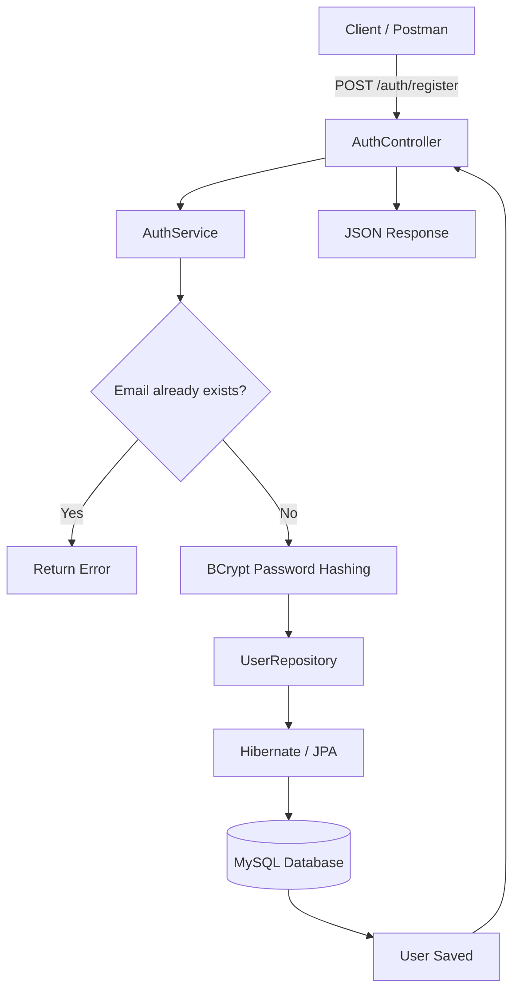
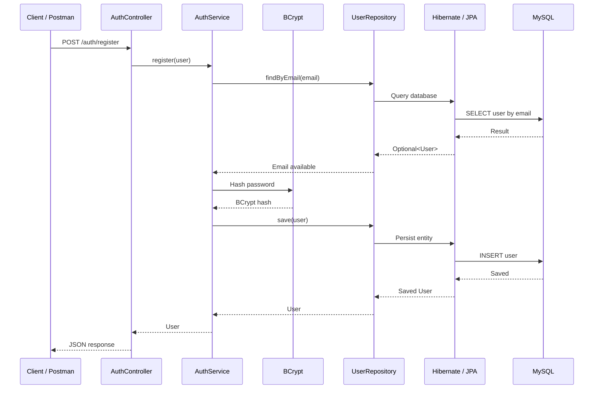
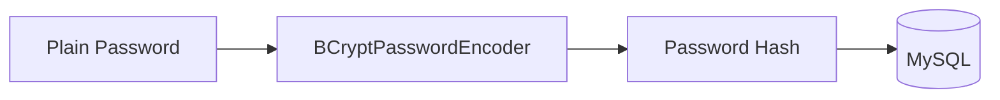

# JWT Authentication - User Registration API

A Spring Boot backend project implementing a user registration API with MySQL persistence and BCrypt password hashing.

> **Current scope:** User registration is implemented. JWT login and token generation will be added in a later phase.

---

## Tech Stack

- Java 21
- Spring Boot
- Spring Web
- Spring Security
- Spring Data JPA
- MySQL
- Maven
- Postman
- Git & GitHub

---

## Project Architecture



---

## Project Structure

```text
jwt-authentication/
│
├── pom.xml
├── mvnw
├── mvnw.cmd
│
└── src/
    └── main/
        ├── java/
        │   └── com/
        │       └── mimansa/
        │           └── jwt_authentication/
        │               │
        │               ├── JwtAuthenticationApplication.java
        │               │
        │               ├── controller/
        │               │   └── AuthController.java
        │               │
        │               ├── service/
        │               │   └── AuthService.java
        │               │
        │               ├── repository/
        │               │   └── UserRepository.java
        │               │
        │               ├── model/
        │               │   └── User.java
        │               │
        │               └── config/
        │                   └── SecurityConfig.java
        │
        └── resources/
            └── application.properties
```

---

## Architecture Layers

The application follows a layered backend architecture:

```text
Client
   │
   ▼
Controller
   │
   ▼
Service
   │
   ▼
Repository
   │
   ▼
Hibernate / JPA
   │
   ▼
MySQL
```

### Controller

Handles HTTP requests and responses.

### Service

Contains business logic such as checking duplicate emails and hashing passwords.

### Repository

Handles database operations using Spring Data JPA.

### Model

Represents the application data and database entity.

### Configuration

Contains Spring Security configuration.

---

# Registration Flow

The current feature is:

```text
POST /auth/register
```

The complete flow is:



---

# User Entity

The `User` entity contains:

```text
User
├── id
├── name
├── email
└── password
```

The entity is mapped to the database using JPA:

```java
@Entity
public class User {
    
    @Id
    @GeneratedValue(strategy = GenerationType.IDENTITY)
    private Long id;

    private String name;
    private String email;
    private String password;
}
```

### `@Entity`

Marks the class as a JPA entity.

### `@Id`

Defines the primary key.

### `@GeneratedValue`

Allows the database to automatically generate the ID.

---

# Repository

`UserRepository` extends `JpaRepository`:

```java
public interface UserRepository extends JpaRepository<User, Long> {

    Optional<User> findByEmail(String email);
}
```

Spring Data JPA automatically provides common operations such as:

```text
save()
findById()
findAll()
delete()
existsById()
```

We also created:

```java
findByEmail(String email)
```

This is used to check whether an email is already registered.

Conceptually:

```sql
SELECT *
FROM user
WHERE email = 'mimansa@example.com';
```

---

# Password Hashing

Passwords are hashed using BCrypt before being stored.



Example:

```text
mypassword123
      │
      ▼
    BCrypt
      │
      ▼
$2a$10$...
      │
      ▼
   MySQL
```

The original plain-text password is not stored in the database.

The hashing is performed using:

```java
passwordEncoder.encode(user.getPassword());
```

---

# PasswordEncoder Configuration

Spring Security provides the `PasswordEncoder` bean:

```java
@Bean
public PasswordEncoder passwordEncoder() {
    return new BCryptPasswordEncoder();
}
```

Spring then injects this dependency into `AuthService`.

```text
Spring Container
       │
       ▼
PasswordEncoder Bean
       │
       ▼
AuthService
       │
       ▼
BCrypt
```

---

# Registration API

## Endpoint

```http
POST http://localhost:8080/auth/register
```

## Request

```json
{
    "name": "Mimansa",
    "email": "mimansa@example.com",
    "password": "mypassword123"
}
```

## Processing

The backend performs the following steps:

1. Receives the request.
2. Converts JSON into a `User` object.
3. Checks whether the email already exists.
4. Hashes the password using BCrypt.
5. Saves the user through `UserRepository`.
6. Hibernate/JPA persists the entity in MySQL.
7. Returns the saved user as a JSON response.

---

# Database

A MySQL database named `jwt_auth` is used.

Create the database using:

```sql
CREATE DATABASE jwt_auth;
```

Application configuration:

```properties
spring.datasource.url=jdbc:mysql://localhost:3306/jwt_auth
spring.datasource.username=root
spring.datasource.password=YOUR_PASSWORD

spring.jpa.hibernate.ddl-auto=update
spring.jpa.show-sql=true
```

### Database Flow

```text
Java User Object
       │
       ▼
Hibernate / JPA
       │
       ▼
MySQL
       │
       ▼
User Table
```

---

# Spring Security

When Spring Security was first added, it protected the API using its default configuration.

The registration endpoint initially returned:

```text
401 Unauthorized
```

The application was then configured to allow registration without authentication:

```java
.requestMatchers("/auth/**").permitAll()
.anyRequest().authenticated()
```

Therefore:

```text
/auth/**
    │
    └── Public

Other endpoints
    │
    └── Authentication Required
```

CSRF is disabled for the current REST API setup:

```java
.csrf(csrf -> csrf.disable())
```

---

# API Testing

The API was tested using Postman.

Request:

```http
POST http://localhost:8080/auth/register
Content-Type: application/json
```

Body:

```json
{
    "name": "Mimansa",
    "email": "mimansa@example.com",
    "password": "mypassword123"
}
```

A successful request saves the user in MySQL.

---

# Running the Project

## 1. Create Database

Open MySQL and run:

```sql
CREATE DATABASE jwt_auth;
```

## 2. Configure Database

Update:

```text
src/main/resources/application.properties
```

with your MySQL credentials.

Do not commit your real database password to GitHub.

## 3. Run Application

On Windows:

```powershell
.\mvnw.cmd spring-boot:run
```

The application runs on:

```text
http://localhost:8080
```

## 4. Test API

Use Postman or another REST client:

```text
POST /auth/register
```

---

# Important Concepts

## Layered Architecture

```text
Controller
    ↓
Service
    ↓
Repository
    ↓
Database
```

## Dependency Injection

Spring creates and injects required dependencies automatically.

Example:

```java
public AuthService(
        UserRepository userRepository,
        PasswordEncoder passwordEncoder) {
    
    this.userRepository = userRepository;
    this.passwordEncoder = passwordEncoder;
}
```

## ORM

Hibernate/JPA maps Java objects to database records.

```text
Java Object
     ↓
Hibernate / JPA
     ↓
SQL
     ↓
MySQL
```

## Password Security

```text
Plain Password
      ↓
BCrypt
      ↓
Hash
      ↓
Database
```

---

# BCrypt vs JWT

These are two different concepts.

### BCrypt

Used to securely hash passwords.

```text
Password
   ↓
BCrypt
   ↓
Hash
   ↓
Database
```

### JWT

Used for authentication after login.

The planned JWT flow is:

```text
Login
  ↓
Verify Email + Password
  ↓
Generate JWT
  ↓
Client receives Token
  ↓
Client sends Token
  ↓
JWT Filter
  ↓
Verify Token
  ↓
Access Protected API
```

JWT token generation is **not implemented in the current version**.

---

# Current Status

## Implemented

- [x] Spring Boot project setup
- [x] Java 21
- [x] MySQL integration
- [x] `jwt_auth` database
- [x] User entity
- [x] JPA repository
- [x] Registration service
- [x] Registration REST API
- [x] BCrypt password hashing
- [x] Spring Security configuration
- [x] API testing with Postman

## Planned

- [ ] Login API
- [ ] JWT token generation
- [ ] JWT authentication filter
- [ ] Protected endpoints
- [ ] DTO-based responses
- [ ] Global exception handling
- [ ] Automated tests
- [ ] Dockerization

---

# Git Workflow

The project is maintained using Git and GitHub.

Typical workflow:


Example:

```bash
git add .
git commit -m "feat: implement user registration with password hashing"
git push
```

---

# Final Architecture

```text
                         CLIENT
                           │
                           │ HTTP Request
                           ▼
                  ┌──────────────────┐
                  │  AuthController  │
                  └────────┬─────────┘
                           │
                           ▼
                  ┌──────────────────┐
                  │   AuthService    │
                  │                  │
                  │ Email Check      │
                  │ BCrypt Hashing   │
                  └────────┬─────────┘
                           │
                           ▼
                  ┌──────────────────┐
                  │ UserRepository   │
                  │  JpaRepository   │
                  └────────┬─────────┘
                           │
                           ▼
                  ┌──────────────────┐
                  │ Hibernate / JPA  │
                  └────────┬─────────┘
                           │
                           ▼
                  ┌──────────────────┐
                  │      MySQL       │
                  │                  │
                  │    jwt_auth      │
                  │      user        │
                  └──────────────────┘
```

---

## Project Summary

This project demonstrates a basic production-oriented backend structure using Spring Boot, Spring Security, Spring Data JPA, Hibernate, MySQL, and BCrypt.

The implemented registration flow separates responsibilities across controller, service, repository, and persistence layers while ensuring that user passwords are hashed before database storage.

The next phase will extend this foundation with JWT-based login and protected APIs.
